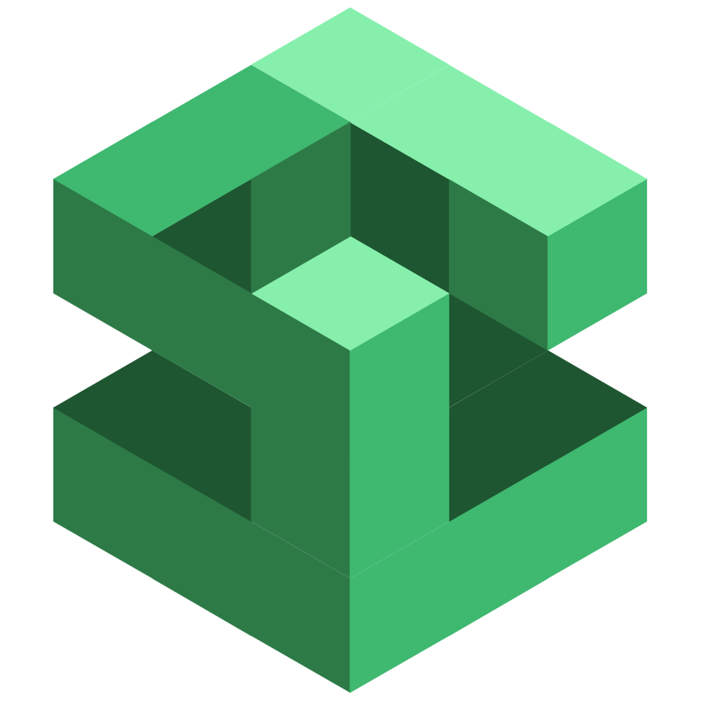

# Mearie

[](https://www.npmjs.com/package/mearie)
[](https://github.com/devunt/mearie/blob/main/LICENSE)

**The Pragmatic GraphQL Client**

A full-featured, framework-agnostic GraphQL client built on proven architectural patterns. Mearie delivers end-to-end type safety, normalized caching, and fragment colocation through ahead-of-time compilation. Write queries as template literals and get complete type inference from schema to UI components.

Supports React, Vue, Svelte, Solid, and vanilla JavaScript through dedicated integrations.

## Architecture

Mearie consists of two parts:

- `mearie` - Build-time code generation and tooling (dev dependency)
- `@mearie/{framework}` - Framework-specific runtime with client and bindings

Here's a quick example:

```tsx
import { graphql, schema } from '$mearie';
import { createClient, httpExchange, cacheExchange, ClientProvider, useQuery } from '@mearie/react';

const client = createClient({
  schema,
  exchanges: [cacheExchange(), httpExchange({ url: 'https://api.example.com/graphql' })],
});

export function App() {
  return (
    <ClientProvider client={client}>
      <UserProfile userId="1" />
    </ClientProvider>
  );
}

function UserProfile({ userId }: { userId: string }) {
  const { data, loading } = useQuery(
    graphql(`
      query GetUser($id: ID!) {
        user(id: $id) {
          id
          name
          email
        }
      }
    `),
    { id: userId },
  );

  if (loading) return <div>Loading...</div>;
  return <h1>{data.user.name}</h1>;
}
```

## Documentation

Full documentation is available at <https://mearie.dev/>.

## Acknowledgments

Mearie's stream-based exchange system and core implementation are derived from [urql](https://github.com/urql-graphql/urql) and [Wonka](https://github.com/0no-co/wonka). The exchange architecture and stream utilities closely follow the original work by the urql team, adapted and extended for Mearie's specific goals. See [ACKNOWLEDGMENTS](./ACKNOWLEDGMENTS.md) for detailed attribution.

## Etymology

The name _Mearie_ (pronounced /meh-ah-ree/) comes from the Korean word
<q>메아리</q>, meaning _echo_.
